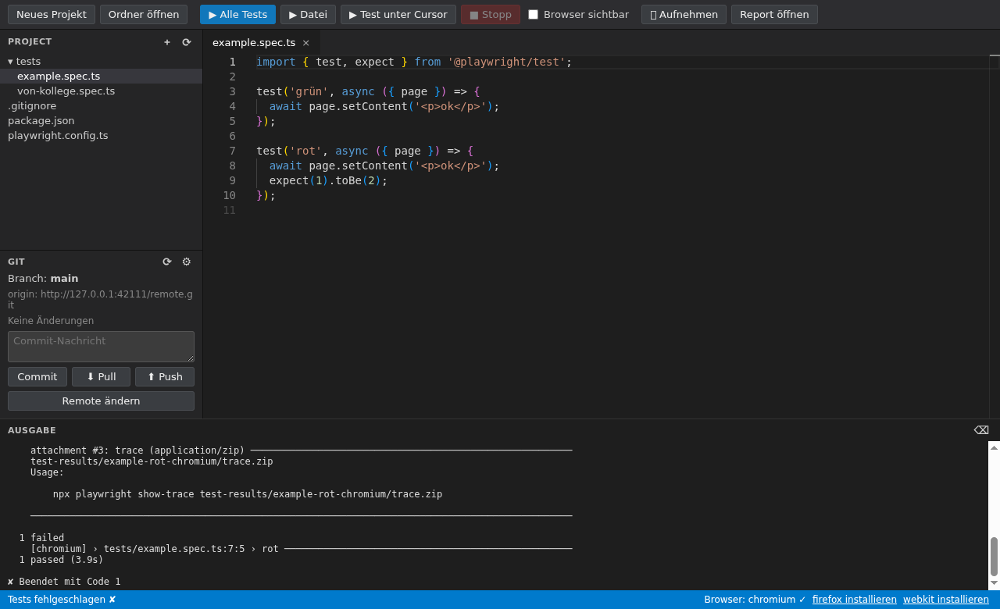

# Playwright Workbench

Desktop-App (macOS & Windows) zum **Schreiben und Ausführen von Playwright-Tests –
ohne Node.js, npm oder Playwright selbst installieren zu müssen**. App
installieren, Projekt anlegen, loslegen.



## Funktionen

- **Editor** auf Basis von Monaco (dem Editor aus VS Code) mit
  Syntax-Highlighting und Autovervollständigung/Typprüfung für `@playwright/test`.
- **Neues Projekt** per Klick: `playwright.config.ts`, Beispieltest,
  `.gitignore` und `package.json` (damit das Projekt auch außerhalb der App mit
  `npm install && npx playwright test` läuft).
- **Tests ausführen**: alle, aktuelle Datei oder nur der Test unter dem Cursor;
  optional mit sichtbarem Browser. Ausgabe live im Ausgabe-Panel, HTML-Report
  per Klick.
- **Aufnehmen** (Playwright Codegen): im Browser klicken, daraus wird
  automatisch eine neue Testdatei.
- **Browser**: Chromium wird beim ersten Start automatisch heruntergeladen
  (einmalig ca. 150 MB), Firefox/WebKit per Klick in der Statusleiste.
- **Git**: Repository klonen, initialisieren, Commit, Pull, Push (HTTPS mit
  Benutzername + Access-Token). Kein installiertes Git nötig. Der Token wird mit
  der Schlüsselbund-Verschlüsselung des Betriebssystems gespeichert.

## Installation

**macOS mit Homebrew (empfohlen):**

```bash
brew install --cask fraigner/tap/playwright-workbench
```

Update später mit `brew upgrade --cask playwright-workbench`.

**Manuell** über die [Releases](https://github.com/FrAigner/playwright-workbench/releases):

- **Windows**: `playwright-workbench-x.y.z-x64.exe`. Da der Installer nicht
  signiert ist, zeigt SmartScreen eine Warnung → „Weitere Informationen“ →
  „Trotzdem ausführen“.
- **macOS**: `playwright-workbench-x.y.z-arm64.dmg` (Apple Silicon) bzw. `-x64.dmg`
  (Intel). Die App ist nur ad-hoc signiert. Beim ersten Start: Rechtsklick →
  „Öffnen“. Falls macOS meldet „ist beschädigt“:
  `xattr -cr "/Applications/Playwright Workbench.app"`.

## Neue Version veröffentlichen

1. `version` in `package.json` erhöhen, committen.
2. Tag setzen und pushen: `git tag -a v0.2.0 -m "…" && git push origin v0.2.0`
   – die Pipeline baut die Installer und hängt sie ans Release.
3. Im Repo [homebrew-tap](https://github.com/FrAigner/homebrew-tap):
   `./update-playwright-workbench.sh 0.2.0`, committen, pushen.

## Git mit GitHub

Unter **GIT → ⚙** Name, E-Mail, GitHub-Benutzername und einen
[Personal Access Token](https://github.com/settings/tokens) (Recht
`repo` bzw. bei fine-grained Tokens „Contents: Read and write“) eintragen.

## Entwicklung

```bash
npm install        # bündelt auch die Playwright-Typen für den Editor
npm start          # App starten
npm test           # End-to-End-Tests der App (Playwright steuert Electron)
npm run dist:mac   # nur auf macOS
npm run dist:win   # auf Windows
```

Die Installer werden per GitHub Actions auf macOS- und Windows-Runnern gebaut
(`.github/workflows/build.yml`), dort laufen vorher auch die E2E-Tests. Ein Tag
`v*` hängt die Installer an ein GitHub-Release.

### Architektur

```
main.js              Electron-Hauptprozess: Dateizugriff, IPC, Fenster
preload.js           sichere Bridge (contextIsolation) zum Renderer
src/runner.js        startet die gebündelte Playwright-CLI mit Electrons
                     eingebautem Node (ELECTRON_RUN_AS_NODE) – daher kein Node nötig
src/paths.js         Pfade zu CLI/Browsern, Prüfung installierter Browser
src/git.js           Git über isomorphic-git (reines JavaScript)
src/template.js      Vorlage für neue Projekte
renderer/            Oberfläche (Monaco, Dateibaum, Git-Panel, Ausgabe)
scripts/bundle-types.js  packt Playwrights .d.ts für die Autovervollständigung
e2e/                 E2E-Tests inkl. lokalem Git-HTTP-Server
```

Die Testdateien importieren `@playwright/test`; aufgelöst wird das über
`NODE_PATH` auf die in der App mitgelieferte Playwright-Version. Browser
landen im App-Datenverzeichnis (`ms-playwright`).
